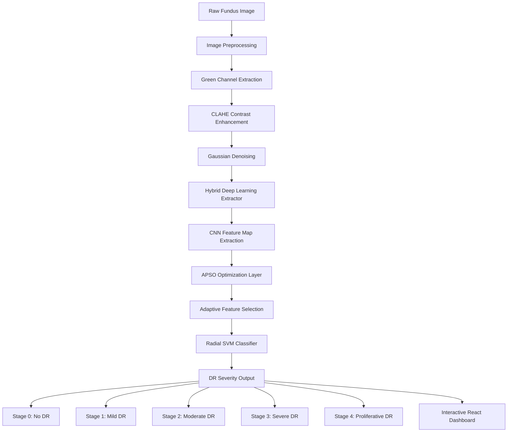

# 👁️ RetinaScan: Hybrid Deep Learning System for Diabetic Retinopathy

> **Automated Diabetic Retinopathy Severity Detection using Image Processing, APSO Optimization, and Radial SVM Classification**

[](https://react.dev/)
[](https://vite.dev/)
[](https://www.python.org/)
[](https://scikit-learn.org/)
[](https://keras.io/)

---

## 👨‍💻 My Role & Contributions (Reguveeran)

In this project, I designed and built the end-to-end pipeline spanning the image processing pipeline, deep learning models, optimization algorithm, classification engine, and the interactive web interface.

### Key Contributions
- **Image Preprocessing Pipeline**: Built automated fundus image enhancement processes including Green Channel Extraction, Contrast Limited Adaptive Histogram Equalization (CLAHE), and Gaussian denoising to highlight microaneurysms and hemorrhages.
- **Hybrid Deep Learning Extractor**: Integrated pretrained CNN backbones (EfficientNet/ResNet) to extract high-dimensional features from retinal fundus images.
- **APSO Feature Optimization**: Implemented the Adaptive Particle Swarm Optimization (APSO) algorithm to perform feature selection, reducing dimensionality while maximizing classification accuracy.
- **Radial SVM Classification**: Built and tuned a Support Vector Machine (SVM) classifier with a Radial Basis Function (RBF) kernel to grade Diabetic Retinopathy severity into 5 clinical stages.
- **Interactive UI (RetinaScan)**: Designed and developed the React + Vite dashboard for clinicians to upload fundus images, view preprocessing steps, run the classification, and manage patient screening records.

---

## 📋 Table of Contents
- [Overview](#-overview)
- [System Architecture](#-system-architecture)
- [Complete Pipeline](#-complete-pipeline)
  - [1. Dataset Collection](#1-dataset-collection)
  - [2. Data Preprocessing](#2-data-preprocessing)
  - [3. Data Augmentation](#3-data-augmentation)
  - [4. Deep Feature Extraction](#4-deep-feature-extraction)
  - [5. Hybrid Feature Fusion](#5-hybrid-feature-fusion)
  - [6. APSO-Based Feature Optimization](#6-apso-based-feature-optimization)
  - [7. Radial SVM Classification](#7-radial-svm-classification)
  - [8. Performance Evaluation](#8-performance-evaluation)
  - [9. User Interface Development](#9-user-interface-development)
  - [10. Future Enhancement](#10-future-enhancement)
- [Short Viva Explanation (1 Minute)](#-short-viva-explanation-1-minute)
- [Tech Stack](#-tech-stack)
- [Project Structure](#-project-structure)
- [Installation & Setup](#-installation--setup)
- [License](#-license)

---

## 🌊 Overview

Diabetic Retinopathy (DR) is a diabetes-related eye disease that damages the retina and can lead to vision loss if not detected early. Manual diagnosis requires experienced ophthalmologists and is time-consuming. 

This project proposes an automated system that classifies retinal fundus images into different DR severity levels using a hybrid approach combining image processing, deep learning, optimization, and machine learning. The objective is to assist doctors by providing fast, accurate, and reliable DR severity predictions.

---

## 🏗️ System Architecture



---

# 🚢 Complete Pipeline

### 1. Dataset Collection
* **Input**: Retinal Fundus Images.
* **DR Severity Classes**:
  - `Class 0` – No DR
  - `Class 1` – Mild DR
  - `Class 2` – Moderate DR
  - `Class 3` – Severe DR
  - `Class 4` – Proliferative DR
* **Challenge**: The dataset was highly imbalanced because some classes contained significantly more images than others (specifically Class 0 and Class 2). This imbalance can cause the model to become biased toward majority classes.

### 2. Data Preprocessing
The retinal images undergo preprocessing to improve quality and remove unwanted variations.
* **Image Resizing**: All images are resized to a fixed dimension suitable for deep learning models (e.g., $512\times512 \rightarrow 224\times224$).
* **Normalization**: Pixel values are normalized to a standard range, resulting in faster convergence, improved model stability, and better feature extraction.
* **Noise Reduction**: Image enhancement techniques (such as Green Channel Extraction, CLAHE, and Gaussian filtering) are applied to improve retinal visibility and vessel clarity.
* **Output**: Clean and standardized retinal images.

### 3. Data Augmentation
* **Problem**: Class 0 and Class 2 contained a large number of samples, while other classes had fewer images.
* **Solution**: Augmentation was applied selectively to minority classes.
* **Techniques Used**:
  - Rotation
  - Horizontal Flip
  - Vertical Flip
  - Zoom
  - Brightness Adjustment
  - Shearing
* **Benefits**: Balances class distribution, reduces overfitting, improves generalization, and increases dataset diversity.
* **Output**: Balanced dataset across all severity levels.

### 4. Deep Feature Extraction
Instead of using only a single model, deep features are extracted from pretrained CNN architectures.
* **Role**: The CNN automatically learns complex visual patterns, including blood vessel structures, exudates, microaneurysms, hemorrhages, and other retinal abnormalities. These features are much more powerful than traditional handcrafted image features.
* **Output**: High-dimensional feature vectors representing each retinal image.

### 5. Hybrid Feature Fusion
* **Concept**: Features obtained from multiple deep learning models are combined into a single feature representation.
* **Benefits**: Each model captures different visual characteristics. Combining them helps improve representation quality, capture complementary information, and increase overall classification accuracy.
* **Output**: A unified feature vector.

### 6. APSO-Based Feature Optimization
* **APSO**: Adaptive Particle Swarm Optimization.
* **Purpose**: The fused feature vector contains many features, but not all contribute equally. APSO is used to identify important features, remove redundant features, and reduce overall dimensionality.
* **Advantages**: Faster classification, reduced computational cost, better accuracy, and improved feature quality.
* **Output**: Optimized feature subset.

### 7. Radial SVM Classification
Instead of using the CNN's final softmax layer, the optimized features are passed to a Radial Basis Function Support Vector Machine (RBF SVM).
* **Why Radial SVM?**: RBF SVM handles complex decision boundaries, non-linear relationships, and high-dimensional feature spaces more effectively than traditional classifiers.
* **Classification Output**: The model predicts the exact class (0 to 4) representing the severity level of Diabetic Retinopathy.

### 8. Performance Evaluation
The model is evaluated using standard metrics:
* **Accuracy**: Measures overall prediction correctness.
* **Precision**: Measures how many positive predictions were correct.
* **Recall**: Measures the ability to identify actual positives.
* **F1 Score**: Balances precision and recall.
* **Confusion Matrix**: Visualizes classification performance for each class.

### 9. User Interface Development
A testing interface was developed to allow users to upload retinal images and receive predictions.
* **Workflow**: 
  $$\text{User Uploads Image} \rightarrow \text{Preprocessing} \rightarrow \text{Feature Extraction} \rightarrow \text{APSO Optimization} \rightarrow \text{Radial SVM Prediction} \rightarrow \text{Severity Result Display}$$
* **Benefits**: Easy to use, doctor-friendly, and provides quick diagnostic support.

### 10. Future Enhancement
* **Encrypted Patient Database**: Maintain separate patient databases for doctors with secure patient records, encrypted storage, historical diagnosis tracking, and follow-up monitoring.
* **Cloud Deployment**: Deploy the system as a secure cloud web application.
* **Explainable AI (XAI)**: Add heatmaps and visual explanations (such as Grad-CAM) showing affected retinal regions.
* **Multi-Hospital Integration**: Enable multiple hospitals and clinics to securely use the platform.
* **Real-Time Screening**: Integrate with fundus cameras for immediate diagnosis.

---

## 📢 Short Viva Explanation (1 Minute)

> "Our project is a hybrid diabetic retinopathy severity detection system. First, retinal fundus images are collected and preprocessed. Since the dataset is imbalanced, data augmentation is applied to minority classes. Deep learning models extract high-level retinal features, which are fused into a single feature vector. Adaptive Particle Swarm Optimization (APSO) selects the most important features, and a Radial SVM classifier predicts the severity level of diabetic retinopathy. A user interface was developed for image upload and prediction. Future work includes encrypted patient databases, cloud deployment, and explainable AI support."

---

## 🛠️ Tech Stack

### Machine Learning & Backend (Python)
- **Python 3.10+** - Core language.
- **TensorFlow / Keras** - Deep learning engine for feature extraction.
- **Scikit-Learn** - For Radial SVM classification, kernel tuning, and cross-validation.
- **OpenCV** - High-speed medical image processing.
- **NumPy & Pandas** - Data structures and mathematical optimization computations.

### Frontend Dashboard
- **React.js 19** - Single Page Application library.
- **Vite** - High-performance local development build tool.
- **React Router 7** - Declarative routing for pages.
- **Lucide React** - Premium clean medical iconography.
- **Vanilla CSS** - Elegant glassmorphic and dark-mode styling.

---

## 📁 Project Structure

```text
retinascan-ui/
├── public/                 # Static assets (logo, sample images)
├── src/
│   ├── assets/             # Images & CSS utilities
│   ├── components/         # Reusable UI components
│   ├── pages/              # Primary dashboard screens
│   │   ├── Login.jsx       # Secure access portal
│   │   ├── Dashboard.jsx   # Image upload, preprocessing comparison, DR classification
│   │   └── PatientList.jsx # Historical screenings & patient logs
│   ├── App.jsx             # Route definitions
│   └── main.jsx            # Application entrypoint
├── package.json            # NPM dependencies & scripts
├── vite.config.js          # Vite configuration
└── README.md               # Project documentation
```

---

## ⚡ Installation & Setup

### Frontend Setup (retinascan-ui)
1. **Clone the repository**:
   ```bash
   git clone https://github.com/Reguveeran/retinascan-ui.git
   cd retinascan-ui
   ```

2. **Install dependencies**:
   ```bash
   npm install
   ```

3. **Start the development server**:
   ```bash
   npm run dev
   ```
   The clinical dashboard will be available at `http://localhost:5173`.

### Backend & Model Training (Kaggle)
To train the hybrid model or run inference on Kaggle:
1. Load your dataset (e.g., EyePACS, APTOS 2019) into your Kaggle workspace.
2. Implement the preprocessing function:
   ```python
   import cv2
   import numpy as np

   def preprocess_fundus(image_path):
       img = cv2.imread(image_path)
       # Green channel extraction
       b, g, r = cv2.split(img)
       # CLAHE
       clahe = cv2.createCLAHE(clipLimit=2.0, tileGridSize=(8,8))
       enhanced_g = clahe.apply(g)
       # Gaussian Denoising
       filtered = cv2.GaussianBlur(enhanced_g, (5, 5), 0)
       return filtered
   ```
3. Run Feature Extraction using a CNN backbone, followed by the APSO optimizer, and train the SVM classifier using `SVC(kernel='rbf')`.

---

## 📄 License

This project is licensed under the MIT License - see the LICENSE file for details.
